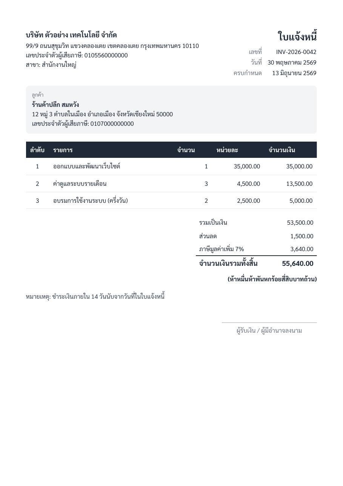

# Thai Document Generator

An HTTP service (and CLI) that turns JSON into clean PDF business documents — invoices,
receipts, and reports — with **correct Thai typography**: proper word breaking, stacked
vowel/tone-mark rendering, Baht formatting, Thai amount-in-words, and Buddhist-era dates.

Rendering is done with headless Chromium, whose ICU/HarfBuzz pipeline handles Thai text
correctly out of the box (where lighter PDF libraries fall short). The Sarabun font is
bundled, so output is identical everywhere.




## Quick start

> Prerequisites: **Docker and git only.**

```bash
git clone https://github.com/peemphetpimolzzz/thai-document-generator.git
cd thai-document-generator

# Render the bundled samples to ./output/*.pdf — no code required
docker compose run --rm samples

# Or run the HTTP service
docker compose up --build
curl -X POST http://localhost:8080/documents/invoice \
  -H 'Content-Type: application/json' \
  -d @samples/invoice.sample.json -o invoice.pdf
```

## API

| Method | Route | Body | Response |
|--------|-------|------|----------|
| `GET` | `/health` | — | `{ "status": "ok" }` |
| `GET` | `/ready` | — | `200` once Chromium is up |
| `POST` | `/documents/invoice` | invoice JSON | `application/pdf` |
| `POST` | `/documents/report` | report JSON | `application/pdf` |

Add `?inline=true` to view in the browser instead of downloading. Invalid bodies return a
`400` with the validation issues. See `samples/` for the JSON shapes.

Invoices support line items, discount, VAT, the total spelled out in Thai
(`...บาทถ้วน`), seller/buyer tax IDs, and an `invoice` / `receipt` title toggle.

## How Thai rendering stays correct

- **Chromium** does Thai word segmentation and mark stacking natively.
- **Sarabun** (SIL OFL 1.1) is bundled and loaded via `@font-face`; the renderer waits for
  `document.fonts.ready` before printing, which prevents the empty-box (“tofu”) failure mode.
- Money is stored as integer satang internally to avoid floating-point drift, and CSS uses
  generous line-height with no letter-spacing so Thai marks never collide.

## Tests

```bash
docker build -t thai-doc .
docker run --rm thai-doc npm run test:unit                    # money / amount-in-words / dates / mapping
docker run --rm --shm-size=1g --init thai-doc npm run test:integration   # renders a PDF and asserts the Thai text survives extraction
```

The integration test renders a real PDF, extracts its text, and asserts the Thai source
strings are present — proving the output is real text, not images of boxes. CI runs all of
this and uploads the sample PDFs as artifacts.

## Configuration

| Env | Default | Purpose |
|-----|---------|---------|
| `PORT` | `8080` | HTTP port |
| `MAX_CONCURRENCY` | `2` | Concurrent renders |
| `FONT_DIR` | `/app/fonts` | Where the bundled fonts live |

## Fonts & licensing

Sarabun and Noto Sans Thai are licensed under the SIL Open Font License 1.1
(see [`fonts/OFL.txt`](fonts/OFL.txt)). Project code is [MIT](LICENSE).

## License

[MIT](LICENSE)
